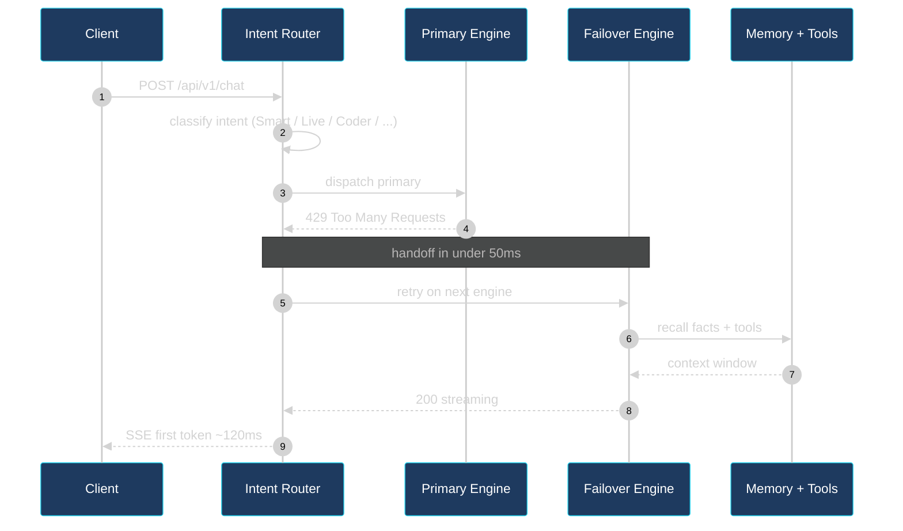

<!--
  sarmakska/sarmakska
  https://github.com/sarmakska
  https://sarmalinux.com
-->

<div align="center">

<a href="https://sarmalinux.com">

</a>

<a href="https://sarmalinux.com">

</a>

<br/>

<a href="https://sarmalinux.com"></a>
<a href="https://sarmalinux.com/hire-me"></a>
<a href="https://sarmalinux.com/blog"></a>
<a href="https://sarmalinux.com/charity"></a>
<a href="https://www.linkedin.com/in/sarmalinux"></a>

<br/>


</div>

<div align="center">


</div>

<br/>

<!-- ============================================================== -->
<!-- ==================== SARMALINK-AI ============================ -->
<!-- ============================================================== -->

<div align="center">

<a href="https://github.com/sarmakska/Sarmalink-ai">

</a>


<br/>

### **Sarmalink-AI** &middot; *one endpoint, thirty-six engines, zero surprise bills*

</div>

<div align="center">

**Drop-in OpenAI-compatible gateway.** Every request fans across 36 engines from 7 providers. When the primary returns 429 or 5xx, the next engine fires in **under 50 milliseconds**. Round-robin key rotation, six specialised modes (Smart, Reasoner, Live, Fast, Coder, Vision), an MCP-shape tool catalog, persistent user memory, FLUX image generation with key rotation, plus TTS / STT cascades. Built so an internal AI product never sees an outage the way a single-provider wrapper does.

<br/>

#### How a request flows

</div>



<br/>

<div align="center">

#### Seven providers, thirty-six engines, six modes

<table align="center">
<tr>
<td align="center" width="14%"><br/><sub><b>5 engines</b><br/>GPT-OSS 120B + 20B</sub></td>
<td align="center" width="14%"><br/><sub><b>4 engines</b><br/>DeepSeek V3.2</sub></td>
<td align="center" width="14%"><br/><sub><b>3 engines</b><br/>Qwen 3 235B</sub></td>
<td align="center" width="14%"><br/><sub><b>4 engines</b><br/>2.5 Flash + 3</sub></td>
<td align="center" width="14%"><br/><sub><b>17 engines</b><br/>Nemotron + GLM</sub></td>
<td align="center" width="14%"><br/><sub><b>images</b><br/>klein 9B + 4B</sub></td>
<td align="center" width="14%"><br/><sub><b>live</b><br/>weather + FX</sub></td>
</tr>
</table>

<br/>

<a href="https://github.com/sarmakska/Sarmalink-ai"></a>
<a href="https://github.com/sarmakska/Sarmalink-ai"></a>
<a href="https://github.com/sarmakska/Sarmalink-ai"></a>
<a href="https://github.com/sarmakska/Sarmalink-ai"></a>
<a href="https://github.com/sarmakska/Sarmalink-ai/wiki"></a>

<br/><br/>

<a href="https://sarmalinux.com/products/sarmalink-ai"></a>
<a href="https://github.com/sarmakska/Sarmalink-ai"></a>

</div>

<br/>

<div align="center">

</div>

<!-- ============================================================== -->
<!-- ==================== SLIPSTREAM =============================== -->
<!-- ============================================================== -->

<br/>

<div align="center">

<a href="https://github.com/sarmakska/slipstream">

</a>


```
$  cp | ctx 12%* ok | mem 4 | obs 37 | opt 71% | skill scoped-read    (~12 steps)
```

### **slipstream** &middot; *Claude Code plugin + cross-IDE MCP toolkit*

</div>

<div align="center">

**First major release.** Fourteen `sp_*` tools replace whole-file reads with scoped symbol pulls, reproducible **~95% per-read savings** via `pnpm benchmark`. A React + Vite + d3 dashboard with nine routed views including an interactive code dependency graph. A cross-tab agent bus that lets multiple Claude Code tabs on one project coordinate at turn boundaries. A cold-start knowledge feed on every SessionStart so no session begins blank. Dollar cost of tokens saved, downloadable session reports, a memory doctor, the insights band, the project knowledge brief, and a 75-skill methodology library.

**Six editor install paths &middot; 321 tests &middot; MIT**

<br/>

<a href="https://github.com/sarmakska/slipstream/releases/tag/v1.0.0"></a>
<a href="https://github.com/sarmakska/slipstream/actions"></a>
<a href="https://github.com/sarmakska/slipstream"></a>
<a href="https://github.com/sarmakska/slipstream"></a>
<a href="https://github.com/sarmakska/slipstream"></a>
<a href="https://github.com/sarmakska/slipstream/blob/main/CHANGELOG.md"></a>
<a href="https://github.com/sarmakska/slipstream/wiki"></a>

<br/><br/>

<a href="https://sarmalinux.com/products/slipstream"></a>
<a href="https://sarmalinux.com/products/slipstream/setup"></a>

</div>

<br/>

<div align="center">

</div>

<!-- ============================================================== -->
<!-- ==================== ECHO ===================================== -->
<!-- ============================================================== -->

<br/>

<div align="center">

<a href="https://github.com/sarmakska/echo">

</a>


<br/>

### **echo** &middot; *the open Jarvis you actually own*

</div>

<div align="center">

**Bring-your-own-subscription.** Echo never asks for an API key. It dispatches each prompt to whichever subscription-backed CLI you already pay for, `claude`, `codex` or `gemini`, picked by a router that scores capability, quota remaining and freshness. Voice in. Voice out. Vision when it helps. Memory across years. Translucent multi-monitor HUD planned. Cross-platform from one Rust core. MIT. Local-first.

**Where it is now:** Foundation + the orchestration layer are in and tested, **64 tests green**. The brain router across `claude`/`codex`/`gemini` is wired and proven against a fake CLI; the file-based memory store with PreSession digests is live; an MCP skills bus runs weather / web search / files; the voice traits are defined and the macOS TTS adapter is real.

**What is still landing:** real Porcupine wake word, real cpal mic capture, real whisper.cpp speech-to-text, real Piper TTS as the cross-platform default, the wired end-to-end voice loop, the setup wizard, sqlite-vss vector memory.

**Then:** HUD polish + multi-monitor, calendar + mail over one-click OAuth, the senses, a proactive engine, autonomous workflows, signed installers.

<br/>

<a href="https://github.com/sarmakska/echo"></a>
<a href="https://github.com/sarmakska/echo"></a>
<a href="https://github.com/sarmakska/echo"></a>
<a href="https://sarmalinux.com/products/echo"></a>

</div>

<br/>

<div align="center">

</div>

<!-- ============================================================== -->
<!-- ==================== ABOUT ==================================== -->
<!-- ============================================================== -->

<br/>

<div align="center">

### About me

</div>

<div align="center">

I am Sarma. I build open-source software from a desk in the UK.

LLM infrastructure, coding agents, inference servers, storage engines, consensus protocols, WebAssembly sandboxes, platform tools. Every project lives on GitHub with a whitepaper, an architecture diagram and a quick-start guide on **[sarmalinux.com/products](https://sarmalinux.com/products)**.

What pulls me back to the desk every weekend is the same thing that pulled me into the industry: the quiet thrill of building something from scratch. A blank repository, a problem worth solving, a system that did not exist yesterday and ships today.

When I am not at the desk, I write long-form essays about what I am learning, contribute to the open-source projects I rely on, and run a small weekend charity where I build free websites for local businesses in Hemel Hempstead.

</div>

<br/>

<div align="center">

</div>

<!-- ============================================================== -->
<!-- ==================== RECENT SHIPS ============================= -->
<!-- ============================================================== -->

<br/>

<div align="center">

### Recent ships

</div>

| Date | What |
|---|---|
| **8 Jun 2026** | [echo](https://github.com/sarmakska/echo) Phase 0 + brain-router scaffolding in: `Brain` trait + Claude/Codex/Gemini subprocess wrappers, capability-and-quota router, file-based memory with PreSession digests, MCP skills bus with weather/web-search/files, voice traits + macOS TTS. 64 tests green. Real wake word, mic, whisper.cpp and Piper are next. v1.0 still aimed at 1 July 2026. |
| **6 Jun 2026** | [slipstream v1.0.0](https://github.com/sarmakska/slipstream/releases/tag/v1.0.0): first major release. React dashboard with nine views, interactive code graph, cross-tab agent bus, cold-start knowledge feed, reproducible `pnpm benchmark` hitting ~95% per-read, dollar cost of tokens saved, memory doctor, 75-skill library, 321 tests. |
| **6 Jun 2026** | [slipstream v0.27.0](https://github.com/sarmakska/slipstream/releases/tag/v0.27.0): production React dashboard (Vite + TypeScript + d3) with grouped sidebar (Now / History / Knowledge), typed JSON client and interactive knowledge graph. |
| **6 Jun 2026** | [slipstream v0.24.0](https://github.com/sarmakska/slipstream/releases/tag/v0.24.0): reproducible token-savings benchmark. `pnpm benchmark` measures whole-file vs scoped reads on real files and prints a Markdown table. |
| **6 Jun 2026** | [slipstream v0.8.0](https://github.com/sarmakska/slipstream/releases/tag/v0.8.0): dashboard insights band. Every data tab opens with a natural-language paragraph plus bullets, deterministic templates, zero LLM. |
| **4 Jun 2026** | [slipstream v0.7.0](https://github.com/sarmakska/slipstream/releases/tag/v0.7.0): tabbed dashboard (Live, Project, Journal, Sessions, Memory) with 365-day heatmap, file leaderboard, kinds donut, distilled lessons. |
| **4 Jun 2026** | [slipstream v0.6.0](https://github.com/sarmakska/slipstream/releases/tag/v0.6.0): cross-IDE parity (`sp_digest` + `sp_resume` + auto-mode-detect + `slipstream-setup`), nine backend features, redesigned glass-on-dark dashboard. |
| **3 Jun 2026** | [NVIDIA Computex 2026 recap](https://sarmalinux.com/blog/nvidia-computex-2026-what-ai-engineers-need-to-know): Vera Rubin NVL72 in production, RTX Spark, Cosmos 3, Nemotron 3 Ultra. |
| **1 Jun 2026** | [AI Engineer World's Fair 2026 recap](https://sarmalinux.com/blog/ai-engineer-worlds-fair-2026-what-mattered): MCP took the year. Six themes that defined where AI engineering is going. |
| **31 May 2026** | [echo](https://github.com/sarmakska/echo) repo opened, public launch scheduled 1 July 2026. |
| **3 May 2026** | [Sarmalink-AI v2](https://github.com/sarmakska/Sarmalink-ai): intent auto-routing, MCP-shape tool catalog, TTS/STT cascades, image generation rotation. |

<br/>

<div align="center">

</div>

<!-- ============================================================== -->
<!-- ==================== PORTFOLIO ================================ -->
<!-- ============================================================== -->

<br/>

<div align="center">

### The portfolio &middot; nineteen MIT-licensed projects

</div>

<table align="center">
<tr>
<td width="50%" valign="top">

#### Flagships
- **[Sarmalink-ai](https://github.com/sarmakska/Sarmalink-ai)** &middot; Multi-provider OpenAI-compatible AI gateway with 36-engine failover across 7 providers, intent-based plugin auto-routing, MCP-shape tool catalog and Manus webhook persistence.
- **[slipstream](https://github.com/sarmakska/slipstream)** &middot; v1.0 shipped. Claude Code plugin and cross-IDE MCP toolkit. Fourteen `sp_*` tools, self-building memory, lossless compaction, React dashboard with nine views and an interactive code dependency graph, cross-tab agent bus, cold-start knowledge feed, 75-skill methodology library. 321 tests, MIT.

#### Coming next
- **[echo](https://github.com/sarmakska/echo)** &middot; An open Jarvis. Brain-agnostic across Claude Code, Codex CLI, Gemini CLI, Ollama and LM Studio. Translucent multi-monitor HUD planned. Phase 0 + Phase 1 orchestration scaffolding in, 64 tests; real audio I/O and the setup wizard ship next. Public v1.0 on 1 July 2026.

#### AI infrastructure
- **[agent-orchestrator](https://github.com/sarmakska/agent-orchestrator)** &middot; Durable multi-agent workflows in TypeScript, deterministic replay, journaled Postgres state, BullMQ step queue, Inspector UI.
- **[voice-agent-starter](https://github.com/sarmakska/voice-agent-starter)** &middot; Sub-second full-duplex WebRTC voice loop, mediasoup SFU, Fastify model worker, pluggable STT, LLM, TTS adapters.
- **[ai-eval-runner](https://github.com/sarmakska/ai-eval-runner)** &middot; Evals as code. Python 3.12, Typer CLI, DuckDB store, FastAPI + HTMX viewer.
- **[forge-infer](https://github.com/sarmakska/forge-infer)** &middot; Minimal LLM inference server in Rust with paged KV-cache, continuous batching and speculative decoding.

#### MCP and AI applications
- **[mcp-server-toolkit](https://github.com/sarmakska/mcp-server-toolkit)** &middot; Production Model Context Protocol server starter in Python and FastAPI.
- **[local-llm-router](https://github.com/sarmakska/local-llm-router)** &middot; OpenAI-compatible proxy routing between Ollama and cloud LLMs by policy.
- **[rag-over-pdf](https://github.com/sarmakska/rag-over-pdf)** &middot; A minimal, production-shaped RAG starter with cited streaming answers.
- **[receipt-scanner](https://github.com/sarmakska/receipt-scanner)** &middot; Vision OCR receipts to Zod-validated JSON.

</td>
<td width="50%" valign="top">

#### Systems software
- **[lsmdb](https://github.com/sarmakska/lsmdb)** &middot; Log-structured merge-tree storage engine in Go. WAL, SSTables, bloom filters, MVCC snapshots.
- **[raftkv](https://github.com/sarmakska/raftkv)** &middot; Raft KV store in Go with a fault-injection harness proving linearizability under partitions.
- **[sandboxd](https://github.com/sarmakska/sandboxd)** &middot; WebAssembly sandbox in Rust with a deny-by-default host ABI and strict CPU, wall-clock and memory bounds.

#### Platform engineering
- **[terraform-stack](https://github.com/sarmakska/terraform-stack)** &middot; Vercel, Supabase, Cloudflare and DigitalOcean modules in one Terraform repo.
- **[k8s-ops-toolkit](https://github.com/sarmakska/k8s-ops-toolkit)** &middot; Helm chart for shipping Next.js to Kubernetes with full observability pre-wired.
- **[shipyard](https://github.com/sarmakska/shipyard)** &middot; Multi-tenant SaaS scaffold in TypeScript. Tenant isolation, RBAC, billing, audit log, rate limits.

#### Tools
- **[webhook-to-email](https://github.com/sarmakska/webhook-to-email)** &middot; Webhook receiver that forwards events to email via Resend.
- **[staff-portal](https://github.com/sarmakska/staff-portal)** &middot; Open-source HR and ops portal. Leave, attendance, expenses, kiosk mode.

</td>
</tr>
</table>

<div align="center">

> Every repo has a bespoke product trio on **[sarmalinux.com/products](https://sarmalinux.com/products)**: whitepaper, architecture diagram, quick-start. All MIT.

</div>

<br/>

<div align="center">

</div>

<!-- ============================================================== -->
<!-- ==================== STACK ==================================== -->
<!-- ============================================================== -->

<br/>

<div align="center">

### Stack


<br/>


<br/><br/>


The full eight-tier stack with every choice and why it earned a place lives at **[sarmalinux.com/technology](https://sarmalinux.com/technology)**. Boring tech, surgical complexity. No AWS, no Azure.

</div>

<br/>

<div align="center">

</div>

<!-- ============================================================== -->
<!-- ==================== STATS ==================================== -->
<!-- ============================================================== -->

<br/>

<div align="center">

### Stats

<a href="https://github.com/sarmakska">

</a>

<br/><br/>

<a href="https://github.com/sarmakska?tab=repositories">

</a>
<a href="https://sarmalinux.com/blog">

</a>


<br/>

<a href="https://github.com/sarmakska">

</a>


</div>

<br/>

<div align="center">

</div>

<!-- ============================================================== -->
<!-- ==================== WRITING ================================== -->
<!-- ============================================================== -->

<br/>

<div align="center">

### Writing

</div>

A handful of good entry points into the **[eighty-seven long-form engineering essays](https://sarmalinux.com/blog)**:

- [NVIDIA Computex 2026, what AI engineers need to know](https://sarmalinux.com/blog/nvidia-computex-2026-what-ai-engineers-need-to-know), Vera Rubin NVL72, RTX Spark, Cosmos 3, Nemotron 3 Ultra
- [AI Engineer World's Fair 2026, what mattered](https://sarmalinux.com/blog/ai-engineer-worlds-fair-2026-what-mattered), six themes that defined the year
- [SarmaLink-AI failover deep dive](https://sarmalinux.com/blog/sarmalink-ai-failover-deep-dive), how multi-engine fallback actually works in production
- [Building Agent Orchestrator](https://sarmalinux.com/blog/building-agent-orchestrator), the journaled-Postgres pattern behind deterministic replay
- [Why I open-sourced 12 repos](https://sarmalinux.com/blog/why-i-open-sourced-12-repos), the reasoning, the trade-offs
- [Terraform Stack vs Pulumi vs SST](https://sarmalinux.com/blog/terraform-stack-vs-pulumi-vs-sst), an honest comparison
- [F1 2026 mid-season after the cancellation](https://sarmalinux.com/blog/f1-2026-mid-season-after-cancellation), because not everything is code

<br/>

<div align="center">

</div>

<!-- ============================================================== -->
<!-- ==================== HIRING =================================== -->
<!-- ============================================================== -->

<br/>

<div align="center">

### Hiring

I am open to **permanent, full-time PAYE** software engineering roles across the United Kingdom. Remote, hybrid or on-site. Senior or mid-level individual contributor in **AI infrastructure**, **AI engineering**, **platform engineering**, **backend** or **full-stack development**. Not taking contract, consulting or agency subcontract work.

The full pitch with a capability matrix, recent ships and selected open-source work lives at **[sarmalinux.com/hire-me](https://sarmalinux.com/hire-me)**.

<br/>

<a href="https://sarmalinux.com/hire-me"></a>
<a href="mailto:projects@sarmalinux.com?subject=Role%20enquiry%2C%20Sarma"></a>

</div>

<br/>

<div align="center">


<sub>Built by <a href="https://sarmalinux.com">sarmalinux</a> &middot; UK &middot; All projects MIT licensed &middot; Updated daily</sub>

</div>
